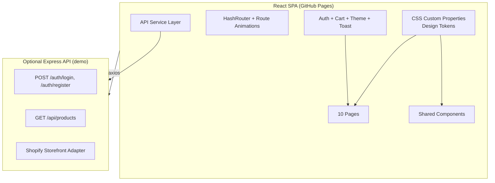

# FireStore eCommerce → Production-Grade Upgrade Plan

> **Goal**: Transform this React e-commerce demo into an impressive, production-ready showcase.

---

## Current State Summary

| Aspect | Status |
|---|---|
| **Stack** | React 19 + Vite 7 + styled-components + react-router v7 |
| **Pages** | 10 (Home, Products, ProductDetails, Cart, Checkout, Account, Login, Register, Contact, 404) |
| **State** | AuthContext (JWT + hardcoded test user), CartContext (localStorage) |
| **Data** | 8 static products in `products.js`, API service pointing to localhost |
| **Images** | 38 static assets (products, logos, gallery, UI icons) |
| **Deploy** | GitHub Pages (currently broken — missing `base` in vite.config) |

---

## Phase 1 · Requirements

> *What specific features, UI upgrades, or integrations need to be built to stand out?*

### 🔴 Critical (Must-Fix — Broken Functionality)

| # | Issue | File(s) | Impact |
|---|---|---|---|
| 3 | **Empty component files** — `ProductCard.jsx` and `CategoryCard.jsx` are 0 bytes | [ProductCard.jsx](file:///home/bmaj/DevToolbox/projects/firestore-2020-ecommerce/src/components/ProductCard.jsx), [CategoryCard.jsx](file:///home/bmaj/DevToolbox/projects/firestore-2020-ecommerce/src/components/CategoryCard.jsx) | Dead code; signals unfinished work |

### 🟡 High-Impact UI Upgrades

| # | Feature | Why It Matters |
|---|---|---|
| 6 | **Modern design system** — CSS custom properties (design tokens) for colors, spacing, radii, and typography | Eliminates the ~15 scattered `#ff523b` / `#563434` / `#555` hardcodes; enables dark mode and theming |
| 7 | **Page transitions / route animations** — Smooth fade or slide between pages | Currently pages "jump" — feels like a basic tutorial project |
| 9 | **Loading skeletons / spinners** — For product grids, product detail, and initial auth check | `ProtectedRoute` shows bare "Loading..." text; product data pop-in has no transition |
| 10 | **Product search + category filter** — Real-time search bar on the Products page | "All Products" page has sort but no way to search — table-stakes for e-commerce |
| 11 | **Responsive header overhaul** — The mobile menu hides auth buttons entirely; cart/account not accessible on mobile | [Header.jsx RightSide](file:///home/bmaj/DevToolbox/projects/firestore-2020-ecommerce/src/components/Header.jsx#L227-L229) hides everything under 768px |
| 12 | **Add-to-cart micro-animation** — Badge bounce, drawer slide-in, or flyout confirmation | Currently nothing happens visually when you add an item |
| 13 | **SEO meta tags** — Title, description, Open Graph per page | Only has `<title>FireStore eCommerce</title>` globally |

### 🟢 "Wow Factor" Differentiators (for Demo)

| # | Feature | Demo Talking Point |
|---|---|---|
| 15 | **AI product recommendation placeholder** — A "Recommended For You" section powered by a simple similarity algorithm or mock API, with a clear annotation showing where an AI model would plug in | Directly speaks to the "AI automation" pillar |
| 16 | **Shopify API integration stub** — A `services/shopify.js` service with mock methods for products, orders, inventory that mirrors the Shopify Storefront API shape | Shows API integration familiarity |
| 17 | **Analytics dashboard stub** — A `/admin/analytics` page showing mock sales/traffic data, charted with a lightweight library | Demonstrates data visualization comfort |
| 18 | **Dark mode toggle** — With smooth theme transition | Modern, premium feel; shows design system maturity |

---

## Phase 2 · Design

> *How should we architect this to reflect a modern, production-grade system?*

### Architecture Overview



### Key Architecture Decisions

#### 1. Design Token System
Extract all colors, spacing, typography into CSS custom properties in `:root`. This enables:
- One-line dark mode via class toggle
- Consistent look across all 10 pages

```css
:root {
  --color-brand: #c45a3c;           /* warm leather brown */
  --color-brand-dark: #8b3a25;
  --color-brand-light: #f4e8e3;
  --color-surface: #ffffff;
  --color-text: #2d2a26;
  --color-text-muted: #6b6560;
  --radius-sm: 8px;
  --radius-md: 16px;
  --radius-full: 9999px;
  --shadow-card: 0 10px 30px rgba(0,0,0,0.06);
  --font-display: 'Playfair Display', serif;
  --font-body: 'Inter', sans-serif;
}
```

#### 3. Component Extraction & DRY
- Extract duplicate `Stars`, `Card`, `SmallContainer`, `Grid` styled-components into shared files
- Build `ProductCard.jsx` and `CategoryCard.jsx` as proper reusable components
- Create a `Toast` system using React Portal + Context

#### 4. Tiered Implementation Strategy

Given the time constraint, implement in **three tiers** so you can ship at each checkpoint:

| Tier | Scope | Est. Time |
|---|---|---|
| **Tier 1** — Critical Fixes | Clean up empty component files | ~1 hr |
| **Tier 2** — UI Polish | Items 6-13 (design tokens, transitions, search, mobile nav, SEO) | ~4-6 hrs |
| **Tier 3** — Differentiators | Items 15-18 (AI section, Shopify stub, analytics, dark mode) | ~4-6 hrs |

---

## Phase 3 · Implementation

> *What are the exact steps and code changes needed?*

### Tier 1 — Critical Fixes (~1 hr)

---

#### 4. Clean Up Empty Files

##### [MODIFY] [ProductCard.jsx](file:///home/bmaj/DevToolbox/projects/firestore-2020-ecommerce/src/components/ProductCard.jsx)
- Implement as a reusable card component with image, title, rating, price, and "Add to Cart" button
- Extract the repeated card pattern from `Products.jsx`, `ProductsSection.jsx`, and `ProductDetails.jsx`

##### [MODIFY] [CategoryCard.jsx](file:///home/bmaj/DevToolbox/projects/firestore-2020-ecommerce/src/components/CategoryCard.jsx)
- Implement as a category image card with overlay text label and `<Link>` to filtered products

---

### Tier 2 — UI Polish (~4-6 hrs)

---

#### 5. Design Token System

##### [MODIFY] [index.css](file:///home/bmaj/DevToolbox/projects/firestore-2020-ecommerce/src/index.css)
- Add CSS custom properties on `:root` for all design tokens
- Add `[data-theme="dark"]` variant
- Import Google Fonts (Inter + Playfair Display)
- Add smooth CSS transitions for theme switching

##### All Component Files
- Replace hardcoded color values (`#ff523b`, `#563434`, `#555`, etc.) with `var(--color-*)` references across all styled-components

---

#### 7. Product Search & Category Filters

##### [MODIFY] [Products.jsx](file:///home/bmaj/DevToolbox/projects/firestore-2020-ecommerce/src/pages/Products.jsx)
- Add search input with debounced filter
- Add category tag chips (derived from product data)
- Update the `sorted` useMemo to also filter by search query and category

##### [MODIFY] [products.js](file:///home/bmaj/DevToolbox/projects/firestore-2020-ecommerce/src/data/products.js)
- Add `category` and `description` fields to each product
- Add 4 more products (use existing images product-9 through product-12) to make the catalog feel fuller

---

#### 8. Loading & Animation Polish

##### [NEW] [Skeleton.jsx](file:///home/bmaj/DevToolbox/projects/firestore-2020-ecommerce/src/components/Skeleton.jsx)
- Shimmer-animated skeleton shapes for product cards, text, and images

##### [MODIFY] [ProtectedRoute.jsx](file:///home/bmaj/DevToolbox/projects/firestore-2020-ecommerce/src/components/ProtectedRoute.jsx)
- Replace "Loading..." text with a branded spinner or skeleton

##### Page Transitions
- Add CSS `@keyframes fadeSlideIn` animation to page wrapper components
- Apply on mount for each page

---

#### 9. Mobile Navigation Fix

##### [MODIFY] [Header.jsx](file:///home/bmaj/DevToolbox/projects/firestore-2020-ecommerce/src/components/Header.jsx)
- Move cart + auth buttons into the mobile slide-down menu
- Add a backdrop overlay when mobile menu is open
- Add animated hamburger → X icon transition

---

#### 10. SEO

##### [MODIFY] [index.html](file:///home/bmaj/DevToolbox/projects/firestore-2020-ecommerce/index.html)
- Add meta description, theme-color, Open Graph tags
- Add favicon link

##### [NEW] [usePageMeta.js](file:///home/bmaj/DevToolbox/projects/firestore-2020-ecommerce/src/hooks/usePageMeta.js)
- Hook that sets `document.title` per page
- Applied in each page component

---

### Tier 3 — Differentiators (~4-6 hrs)

---

#### 12. AI Recommendation Section

##### [NEW] [RecommendedProducts.jsx](file:///home/bmaj/DevToolbox/projects/firestore-2020-ecommerce/src/components/home/RecommendedProducts.jsx)
- "Recommended For You" section on Home page
- Uses a simple content-based similarity function (same category, overlapping price range)
- Annotated with "Powered by AI" badge and comment explaining where a real ML model would plug in

#### 13. Shopify Integration Stub

##### [NEW] [shopify.js](file:///home/bmaj/DevToolbox/projects/firestore-2020-ecommerce/src/services/shopify.js)
- Mock service that mirrors Shopify Storefront API shape
- Methods: `getProducts()`, `getProduct(id)`, `createCheckout()`, `getOrders()`
- Returns local data in Shopify's GraphQL response format

#### 14. Dark Mode Toggle

##### [NEW] [ThemeContext.jsx](file:///home/bmaj/DevToolbox/projects/firestore-2020-ecommerce/src/context/ThemeContext.jsx)
- Context provider with `theme` state (`light` / `dark`)
- Toggles `[data-theme="dark"]` class on `<html>`
- Persists preference in localStorage

##### [MODIFY] [Header.jsx](file:///home/bmaj/DevToolbox/projects/firestore-2020-ecommerce/src/components/Header.jsx)
- Add theme toggle button (sun/moon icon)

---

## Phase 4 · Review

> *How will we test and validate this to ensure high standards before the live demo?*

### Automated Verification

| Test | Command / Action | What It Validates |
|---|---|---|
| **Vite Build** | `npm run build` | No compilation errors, correct `base` path |
| **ESLint** | `npm run lint` | No lint errors or warnings |

### Browser Testing (via browser tool)

| # | Step | Expected Result |
|---|---|---|
| 1 | Open `http://localhost:5173` (or port shown by dev server) | Home page loads with hero, categories, products, offer, testimonials, brands, footer |
| 2 | Click a product card on the home page | Navigates to `/products/:id` **without full page reload**; cart badge preserved |
| 3 | Click "Add To Cart" on product details | Toast notification appears confirming the item was added; cart badge increments |
| 4 | Navigate to `/cart` | Cart shows the added item with correct price and quantity |
| 5 | Click "Proceed to checkout" | Navigates to `/checkout` with order summary |
| 6 | Click "Logout" in header | User is logged out; protected routes redirect to `/login` |
| 7 | Submit login form with valid demo credentials | User is logged in; header shows greeting; protected routes accessible |
| 8 | Search for a product on `/products` | Grid filters in real-time as you type |
| 9 | Resize browser to mobile width (<768px) | Hamburger menu appears; clicking it shows nav + cart + auth buttons |
| 10 | Check the 404 page by navigating to `/nonexistent` | 404 page renders (not a GH Pages error) |

### Pre-Demo Checklist

- [ ] All 10 pages accessible, no broken links
- [ ] No `alert()` calls remaining — all replaced with toasts
- [ ] No lorem ipsum text — all copy is real or domain-relevant
- [ ] Product images load correctly
- [ ] Cart survives page transitions (localStorage persistence)
- [ ] Login/Register flow works end-to-end (demo mode)
- [ ] Mobile responsive on all pages
- [ ] `npm run build` succeeds with zero warnings
- [ ] Deployed to GitHub Pages and working at the published URL
- [ ] Dark mode toggle works (if Tier 3 is included)

---

## Notes
- Deployment fixes, Auth routing, and Toast notifications have been fully implemented.
